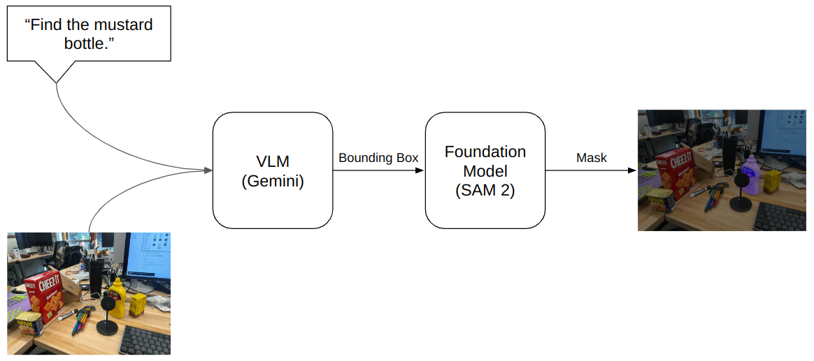
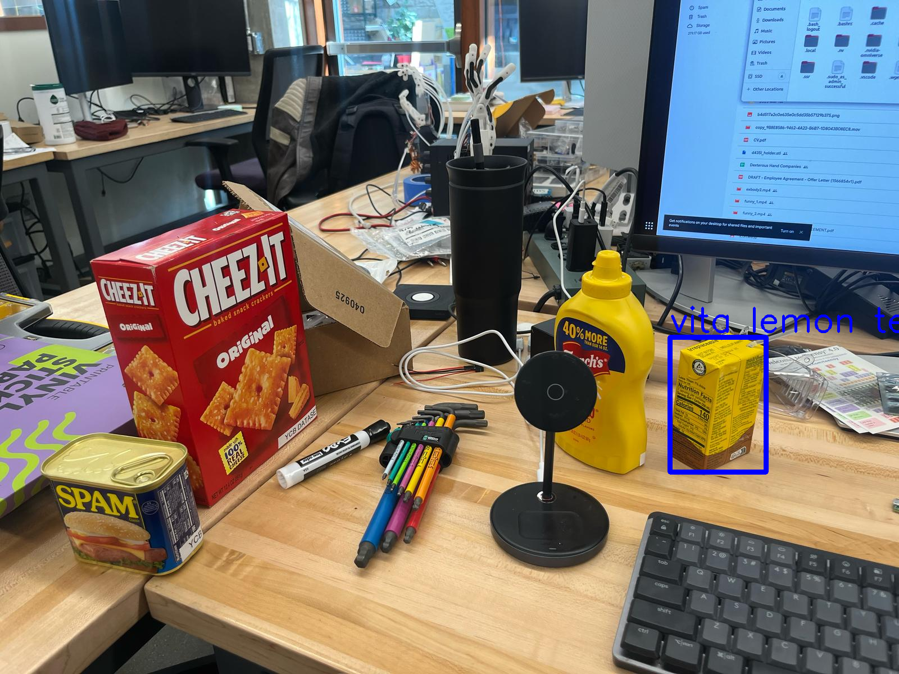

# VLM Grasping
This is a demo combining [Google Gemini](https://gemini.google.com/) and [Segment Anything Model 2 (SAM 2)](https://github.com/facebookresearch/sam2) for open-vocabulary manipulation tasks.





## Laptop/Workstation Setup
This demo has been tested on
* Ubuntu 22.04 + Pyhton 3.10 + RTX 4060 Laptop + CUDA 12.1
* Ubuntu 24.04 + Pyhton 3.12 + RTX 4060 Ti + CUDA 12.1

## Installation
Create a Python vistual environment.
```sh
python -m venv ~/venvs/vlm
```

Install [Segment Anything Model 2 (SAM 2)](https://github.com/facebookresearch/sam2)
```sh
cd ~ # Install in home directory by default.
git clone https://github.com/facebookresearch/sam2.git
cd sam2

# Make sure installing SAM 2 in the Python virtual environment.
source ~/venvs/vlm/bin/activate
pip install -e .

# Download checkpoints
cd checkpoints
./download_ckpts.sh
```

Install this package
```sh
# Make sure installing dependencies in the Python virtual environment.
source ~/venvs/vlm/bin/activate

# Install Dependencies
cd <path-to-this-project>
pip install -r requirements.txt
```

## Demo
Before running the demo, setup `google_gemini_api_key` and `sam2_directory` in [config/config.yaml](https://github.com/mvyp/vlm_grasping/config/config.yaml):
```yaml
google_gemini_api_key: # Use your own API key
sam2_directory: # For example: /home/zhengxiao-han/sam2
```

To run the demo, simply run `demo.py`
```sh
# Make sure using the Python virtual environment.
source ~/venvs/vlm/bin/activate
python demo.py
```
